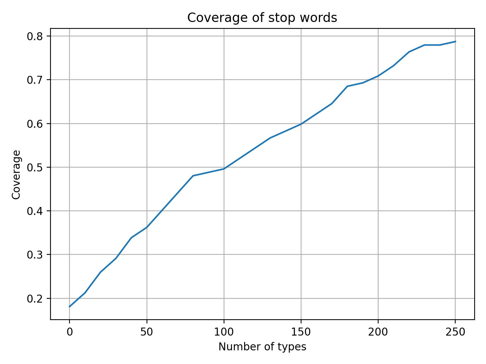
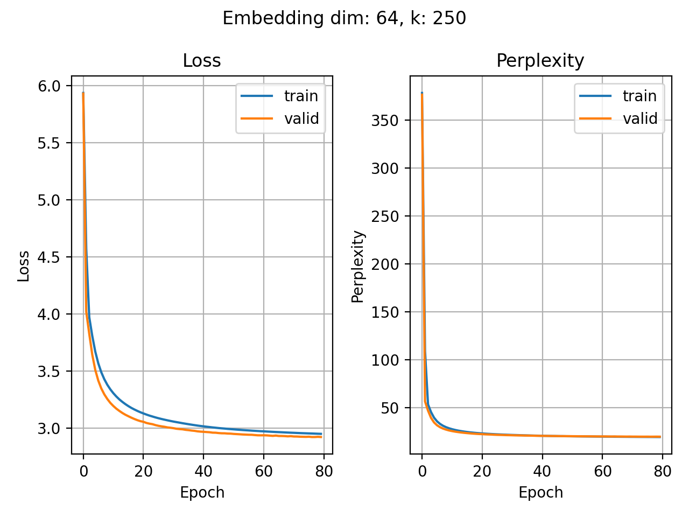
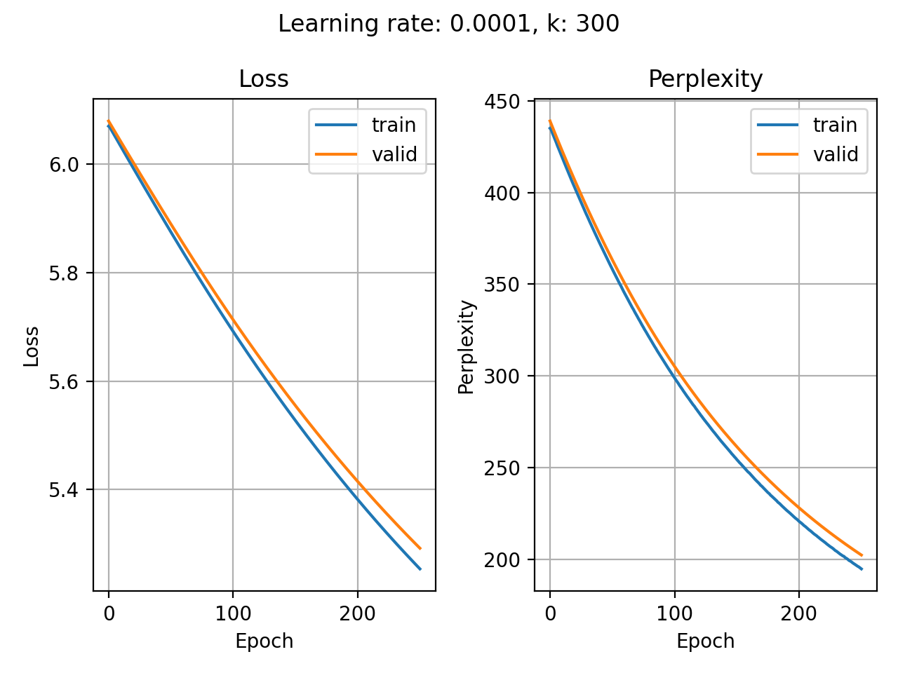

# Milestone 1: Byte Pair Encoding

**Average branch factor of vocabulary:**  
We can see that as we in crease the number of tokens in our token vocabulary(k-value), specifically by merging individual character tokens, to create longer subwords, the Branch factor(number of distinct tokens ever to follow a given token, divided by all tokens) decreases and the longer subwords become more predictive of what comes next.

Notice also the diminishing returns:  
the biggest drop happens in the first few dozen merges; after ~100–150 types the curve starts to flatten out. That suggests that beyond a certain vocab size, each additional merge only marginally improves the “predictability” (in this branching‐factor sense) of our token set.

**Coverage of full words:**  
On the y-axis we see the fraction of all word-tokens in our corpus(test set) that appear in our BPE vocabulary as a single token(i.e. the entire word has been learned).  

At very small vocabs(only characters and a few merges) no whole words are atomic tokens, so coverage is ≈0.

**Coverage of morphemes:**  
Here we measure the fraction of gold-standard morphological segments (prefixes, roots, suffixes, etc.) that exist in our learned vocab as a single token.  

We see this starts climbing quickly (to ~0.25 by ~80 merges) and plateaus around ~0.32 by 140 merges.

BPE picks up common morphemes (e.g. “ing”, “ed”, “pre”, “un”, “tion”, etc.) much sooner than it picks up whole words, and by ~150 merges we’ve captured roughly one‐third of our annotated morphemes.  

**Coverage of stop words:**  
This plots the fraction of all stop‐word tokens (the usual list: “the”, “and”, “to”, “of”, …) that appear in our vocab as single tokens.

Because stop words are extremely frequent, BPE very quickly merges them into one piece. We see coverage already at ~18% with just a few merges, and ramping up to ~78% by ~250 merges.  
In practice this means by a couple hundred merges most common function‐words are represented atomically, which can be a big win for downstream models.  

**Interpretation of plots:**  
These plots help us choose a merge-budget k that balances:  
Getting our frequent function‐words and morphemes atomically represented,
without exploding our vocab size trying to cover rare full words that hardly ever occur.  

---

# Milestone 2: N-Gram

**Bigram Perplexity vs. Add-k Constant**:  
Here we fix $n = 2$ (bigram) and vary the Laplace smoothing constant k on the test set:
At $k=0$ (no extra smoothing), the bigram model achieves its lowest perplexity (~11.1).
As you increase k, it adds add more “virtual” counts to every possible next word, flattening the distribution and steadily raising perplexity up to ~49 at k=245.

**Perplexity vs. n-Gram Order**:  
This plot compares three smoothing/backoff strategies as we increase the model order $n$ from unigram (1) to 6-gram (6):  
Together, these curves trace the progression of our code from basic add-k smoothing (N_Gram_Basic.py), through interpolation (N_Gram_Advanced.py).  

**Interpretation of plots:**  
Backoff performs best. That might be because it uses higher-order N-grams when sufficient data is available, but gracefully falls back to lower-order models when data is sparse. This allows it to benefit from context without overfitting or assigning zero probabilities.
Laplace smoothing, on the other hand, adds a fixed count to all possible N-grams, which leads to over-smoothing—especially as n increases. This flattens the probability distribution too much and results in high perplexity for larger N-gram models.

This chart shows how varying the add-k smoothing constant $𝑘$ in our 6-gram backoff language model affects its test perplexity. At $𝑘=0$, we use pure backoff (no extra smoothing) and achieve the lowest perplexity. As $𝑘$ increases, we add more “virtual” counts to every possible continuation, flattening the conditional distributions and steadily degrading model sharpness, so perplexity climbs almost linearly.  
This sweep underpins the smoothing `get_prob_backoff_logic()` object in 'N_Gram_Advanced.py'. It demonstrates that minimal or zero add-k smoothing is optimal for our dataset, and illustrates why we keep $𝑘$ small when progressing to more advanced interpolation and neural embedding experiments.

## Generated text

All text was generated using the context: "hello julia".

### Bigram 

| Model & Method                   | Generated text                                                                                                                         |
| -------------------------------- | -------------------------------------------------------------------------------------------------------------------------------------- |
| **Backoff – Argmax**             | `hello julia patatatatatatatatatatatatatatatatatatatatatatatatatatatatatatatatatatatatatatatatatatatatatatatatata`                     |
| **Backoff – Sampling**           | `hello julia ommued[shu/strecodooff it ma_an rk hiy, wich eard .`                                                                      |
| **Laplace Smoothing – Argmax**   | `hello julia patatatatatatatatatatatatatatatatatatatatatatatatatatatatatatatatatatatatatatatatatatatatatatatatata`                     |
| **Laplace Smoothing – Sampling** | `hello julia perenmanif ost not your sweyex'somevansp, ssce thinuo me you {t, tis and serk to you.`                                    |
| **Interpolation – Argmax**       | `hello julia patatatatatatatatatatatatatatatatatatatatatatatatatatatatatatatatatatatatatatatatatatatatatatatatata`                     |
| **Interpolation – Sampling**     | `hello julia what haivod ce to love you ourd with hamo, and w; ouly e]is entexit dius ence, thou n th, with a ?thoueak iltodest's ...` |

As we can see a bigram model only considers the last single token when predicting the next one. This extremely limited context cannot capture long-range dependencies, so the generated text quickly devolves into locally probable but globally incoherent token sequences.
In these examples, we see very strong self-loops or dominant transitions (e.g., "julia" → "patata"). Argmax always picks the single most probable continuation, so regardless of the smoothing or interpolation strategy, the model locks into the same repetitive loop. This effect is strongest for bigrams because the model only considers one previous token. If a single word has a highly probable self-loop or dominant successor, Argmax will choose it every time, creating an immediate repetition loop.

### 6-Gram Backoff:

| Modell & Methode                 | Generierter Text                                                                                                                                                        |
| -------------------------------- | ----------------------------------------------------------------------------------------------------------------------------------------------------------------------- |
| **Backoff – Argmax**             | `hello julia i will not leave their tinct.`                                                                                                                             |
| **Backoff – Sampling**           | `hello julia worshiearabut er +e hike disoul; be hamark , the shy, whipthpthere ablius cir pge in the fraulauke strth no d, wearbenck {but we ouursemato't for th ~.  ` |

Higher-order n-grams (here 6-grams) use a longer context, so the dominant continuation changes as the context changes, making endless repetition far less likely. Backoff strengthens the effect by reducing the window size if the context is unkown. 
Here we can cleary see, that the argmax outcome seems far more realistic. Thats because sampling, on the other hand, occasionally picks lower-probability continuations. In a small dataset like Shakespeare’s, these rare continuations are often poorly estimated or spurious due to data sparsity.

### 6-Gram Laplace-Smoothing:

| Modell & Methode                 | Generierter Text                                                                                                                                                        |
| -------------------------------- | ----------------------------------------------------------------------------------------------------------------------------------------------------------------------- |
| **Laplace-Smoothing – Argmax**   | `hello julia with with with with with with with with with with with with with with with with with with with with with with with with with with with with with with[...]`|
| **Laplace-Smoothing – Sampling** | `hello julia lidisithoucst and youc0]#on +ringyou gwixsi#ri]cu#wiyouo s}sif may}, \; chdforat 3on fd w(j;lfornoh? "en ch 94ch -nmy an ashllseforle.`                    |

For Laplace-Smoothing however we again see the repetions regardles the higher-order n-gram. Thats because it adds a constant to all counts, flattening the distribution. This leads to overly uniform probabilities and, in Argmax mode, can produce pathological repetition because certain high-count tokens remain dominant regardless of broader context.

Please note that under milestone_2/generated_texts, you will find more generated text samples for N-grams with values of n = 1 to 6. For each N-gram setting, there are examples using the three smoothing strategies: Backoff, Interpolation, and Laplace.
For each of these smoothing methods, both sample-based and argmax-based predictions are provided.

# Milestone 3: Neural Bigram

## Hardcore Version (Pythonic implementation)  

Table of learning rate, k-value, and corresponding test perplexity for each test case:

| Learning rate | k   | Test perplexity         |
| ------------- | --- | ----------------------- |
| 0.0001        | 100 | 51.96405116371911       |
| 0.0005        | 100 | 36.184124747417904      |
| 0.001         | 100 | **34.02115555646833**      |
| 0.0001        | 200 | 116.14822555166036      |
| 0.0005        | 200 | 60.31262235967866       |
| 0.001         | 200 | 52.265199067775704      |
| 0.0001        | 300 | 198.03245161646214      |
| 0.0005        | 300 | 86.18883114787684       |
| 0.001         | 300 | 68.85538667604982       |
| 0.0001        | 500 | 409.808096641118        |
| 0.0005        | 500 | 164.47371997092182      |
| 0.001         | 500 | 117.54506487691079      |
|               |     |                         |
| **Best:**                                     |
| Learning rate: 0.001 | k: 100 | Test perplexity: **34.021** |

## Softer version (PyTorch implimentation)

Hyperparameter search

Table of learning rate, k value, and corresponding test perplexity for each test case:

| Learning rate | k   | Test perplexity         |
| ------------- | --- | ----------------------- |
| 0.0001        | 100 | 33.212650299072266      |
| 0.0005        | 100 | **32.912742614746094**      |
| 0.001         | 100 | 33.70339584350586       |
| 0.0001        | 200 | 48.84163284301758       |
| 0.0005        | 200 | 48.04667663574219       |
| 0.001         | 200 | 49.09096145629883       |
| 0.0001        | 300 | 59.62310791015625       |
| 0.0005        | 300 | 57.317710876464844      |
| 0.001         | 300 | 59.76580810546875       |
| 0.0001        | 500 | 82.57501220703125       |
| 0.0005        | 500 | 76.4788818359375        |
| 0.001         | 500 | 79.92401885986328       |
|               |     |                         |
| **Best:**                                     |
| Learning rate: 0.0005 | k: 100 | Test perplexity: **32.912** |

The comparison between the "Hardcore" and "softer" version of implementing the embeddings shows an aproximate 3.3% increase in perplexity score result (Absolute drop: −1.109 perplexity points).

---

## Extra work: Neural N-Gram
LSTM to incorporate time

Best model: Perplexity is about 14 with the Neural 4-Gram.  
Here we use an LSTM, neural network to capture sequential dependencies and context beyond fixed the previos clasical n-gram windows. Using the LSTM we try to "weight" the importance of each previous token, not just memorize fixed-length patterns. We can see that the perfomance of this N-gram performs slightly better than the previous classic N-grams.

## Comparing Neural N-Gram with the classic N-Gram

Interestingly, the classic 4-gram model with backoff (perplexity ≈ 7) outperformed the neural 4-gram model (perplexity ≈ 14), even though both were trained solely on Shakespeare. The key factor is data sparsity: the backoff mechanism in the classic model directly addresses sparsity by reverting to lower-order n-grams (n-1, n-2, etc.) when higher-order contexts are unavailable. In contrast, the neural n-gram must learn through backpropagation how to handle sparse data — a challenging task given the small, domain-specific training corpus. It is likely that, with a substantially larger and more diverse dataset, the neural n-gram would surpass the classic backoff model in terms of perplexity.

# GPT

The results from Milestone 2 (see ./milestone_2/plots/PerplexityBigramDifferentK.png or ./milestone_2/plots/Perplexity6_GramDifferentK.png) suggest that the perplexity is increase with the vocab size because of the artifact of sparsity. So we tried out differte k values (50, 150, 250 and 1000) over different embedding sizes (16, 32, 64)

### Perplexity Results for the test set

| Embedding Dim | Vocab Size (k) | Test Perplexity |
|---------------|----------------|-----------------|
| 16            | 50             | 16.65           |
| 32            | 50             | 11.28           |
| 64            | 50             | **8.15**        |
| 16            | 150            | 34.53           |
| 32            | 150            | 20.77           |
| 64            | 150            | 13.95           |
| 16            | 250            | 51.29           |
| 32            | 250            | 28.82           |
| 64            | 250            | 19.92           |
| 16            | 1000           | 108.49          |
| 32            | 1000           | 77.34           |
| 64            | 1000           | 58.92           |
|                                                  |
| **Best:**                                        |
|Embedding dim = 64 | k = 50 | Test Perplexity = **8.15**|

### Embedding Dimensions = 16

### Embedding Dimensions = 64

### Effect of embedding dimension.

The results show that models with larger embedding dimensions achieve consistently lower loss and perplexity compared to those with smaller embeddings. The reason is that larger embeddings provide richer vector representations of tokens, allowing the model to capture more subtle syntactic and semantic dependencies. The difference becomes visible because a 16-dimensional embedding is too restrictive: it cannot encode the variety of contexts needed for reliable predictions. A 64-dimensional embedding, in contrast, gives the model enough representational capacity to generalize better from the limited data, which explains the substantially improved perplexity curves. Also it needs less epoch to be trained.

### Effect of vocabulary size (k)

Across both embedding dimensions, smaller vocabulary sizes (k=50) result in significantly lower perplexity compared to larger vocabularies (k=250 or beyond). As already explained above, the explanation lies in data sparsity: with a small corpus like Shakespeare, increasing k means that many tokens and token combinations appear very rarely, making it difficult for the model to learn stable probability estimates. With fewer tokens (small k), each token appears more frequently, allowing the model to estimate distributions more reliably and reduce uncertainty. Thus, while larger embeddings help, they cannot fully overcome the sparsity introduced by large vocabularies on such a limited dataset.

### Generated Texts among different sampling techniques

**k = 50**

| Sampling Technique | Output                                                                                                                                                                              |
| ------------------ | ----------------------------------------------------------------------------------------------------------------------------------------------------------------------------------- |
| **Argmax**         | `hello julia i have not seen my lord, and that i have not been my lord, and that i have not seen my lord, and that i have seen my lord, and that i have seen made me to be said to` |
| **Sampling**       | `hello julia that must not up yet by the philost requires have not chafe within.`                                                                                                   |
| **TopK**           | `hello julia what i do, you are no greats; that is morning, i have placed to some amen, if may call'd upon it; the good, that is a frates; and this soldier courtesy`               |
| **TopP**           | `hello julia what is your life to the master to be heart and my love, and say the world.`                                                                                           |

**k = 250**

| Sampling Technique | Output                                                                                                                                                                                                                           |
| ------------------ | -------------------------------------------------------------------------------------------------------------------------------------------------------------------------------------------------------------------------------- |
| **Argmax**         | `hello julia i am not to be a place.`                                                                                                                                                                                            |
| **Sampling**       | `hello julia we should not went away! roderigo with him; i think your expresent is it him.`                                                                                                                                      |
| **TopK**           | `hello julia my lord bassanio ay, you were me, but you shall go with you, but i am a sleep.`                                                                                                                                     |
| **TopP**           | `hello julia what, for the air, that i am continue to speak on the friends: and this is gone, sir, it will go to the revenge of my place, as he would speak as long as admiried as i do revenge; when you have no hand but made` |

As seen above Argmax has repetition and loops. In contrast, pure sampling draws from the full probability distribution, introducing diversity. However, because it also allows very low-probability tokens to be chosen, it often produces incoherent or ungrammatical text, especially with small datasets.
Top-k and top-p sampling produce the most realistic text because they balance variation and coherence. Unlike pure argmax, which always chooses the single most probable token and often falls into repetitive loops, and unlike unconstrained sampling, which may select very unlikely tokens and produce nonsense, top-k and top-p restrict the sampling space to plausible continuations. Top-k fixes the number of candidates, while top-p dynamically adapts the candidate set based on cumulative probability mass. Both methods prevent low-probability noise while still allowing diversity, which results in outputs that are more fluent and natural-sounding.

Under /GPT/generated_texts/{emb_dim}_{k} you can find all the generated texts based on "hello julia"

## Comparing GPT with Neural N-Gram and classic N-Gram

The 6-gram backoff model achieves the best performance in terms of perplexity (as low as ~5), especially with small vocabularies. This surprisingly strong result arises because backoff n-grams effectively memorize frequent local patterns in the small and repetitive Shakespeare dataset, where many 6-token contexts reappear exactly. The backoff mechanism further mitigates sparsity by reverting to shorter histories when necessary, making predictions robust. However, this advantage is largely an artifact of memorization and does not generalize well: as the vocabulary size grows, sparsity dominates and perplexity increases almost linearly.

By contrast, the Transformer excels in principle because it can capture long-range dependencies and leverage embeddings for richer representations, but on this small dataset its capacity is underutilized. Instead of memorizing, it must learn probabilistic structure for many rare contexts, which keeps its perplexity higher than that of the n-gram backoff despite its more advanced architecture. The neural bigram performs worst overall, as it is bottlenecked by the extremely short context of only one token. The neural n-gram with LSTM offers a middle ground

# Appendix

### Milestone 3: Loss and Perplexity among different learning rates and k

#### Hardcore Version

***learning rate: 0.001***

*k = 100*

*k = 300*

*k = 500*

***learning rate: 0.0001***

*k = 100*

*k = 300*

*k = 500*

***learning rate: 0.0005***

*k = 100*

*k = 300*

*k = 500*

#### Soft Version

***learning rate: 0.001***

*k = 100*

*k = 300*

*k = 500*

***learning rate: 0.0001***

*k = 100*

*k = 300*

*k = 500*

***learning rate: 0.0005***

*k = 100*

*k = 300*

*k = 500*

%doto milestone_2/soft/plots here
%doto milestone_2/hardcore/plots here

### GPT
### Embedding Size 16 on different k:  

### Embedding Size 32 on different k:  

### Embedding Size 64 on different k:  

