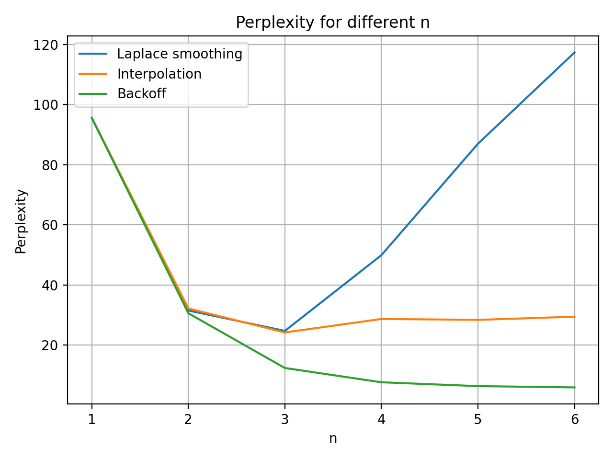

# Milestone 1: Byte Pair Encoding


# Milestone 2: N-Gram




## Generated text

%doto: siehe milestone_2/generated_texts

# Milestone 3: Neural Bigram

## Soft

Hyperparameter search

%doto: transform this into a table

```
Test
Learning rate: 0.0001, k: 100 -> test perplexity: 33.212650299072266
Test
Learning rate: 0.0005, k: 100 -> test perplexity: 32.912742614746094
Test
Learning rate: 0.001, k: 100 -> test perplexity: 33.70339584350586
Test
Learning rate: 0.0001, k: 200 -> test perplexity: 48.84163284301758
Test
Learning rate: 0.0005, k: 200 -> test perplexity: 48.04667663574219
Test
Learning rate: 0.001, k: 200 -> test perplexity: 49.09096145629883
Test
Learning rate: 0.0001, k: 300 -> test perplexity: 59.62310791015625
Test
Learning rate: 0.0005, k: 300 -> test perplexity: 57.317710876464844
Test
Learning rate: 0.001, k: 300 -> test perplexity: 59.76580810546875
Test
Learning rate: 0.0001, k: 500 -> test perplexity: 82.57501220703125
Test
Learning rate: 0.0005, k: 500 -> test perplexity: 76.4788818359375
Test
Learning rate: 0.001, k: 500 -> test perplexity: 79.92401885986328
###################
Best:
Learning rate: 0.0005, k: 100 -> test perplexity: 32.912742614746094
```


## Hardcore


%doto: transform this into a table

```
Test
Learning rate: 0.0001, k: 100 -> test perplexity: 51.96405116371911
Test
Learning rate: 0.0005, k: 100 -> test perplexity: 36.184124747417904
Test
Learning rate: 0.001, k: 100 -> test perplexity: 34.02115555646833
Test
Learning rate: 0.0001, k: 200 -> test perplexity: 116.14822555166036
Test
Learning rate: 0.0005, k: 200 -> test perplexity: 60.31262235967866
Test
Learning rate: 0.001, k: 200 -> test perplexity: 52.265199067775704
Test
Learning rate: 0.0001, k: 300 -> test perplexity: 198.03245161646214
Test
Learning rate: 0.0005, k: 300 -> test perplexity: 86.18883114787684
Test
Learning rate: 0.001, k: 300 -> test perplexity: 68.85538667604982
Test
Learning rate: 0.0001, k: 500 -> test perplexity: 409.808096641118
Test
Learning rate: 0.0005, k: 500 -> test perplexity: 164.47371997092182
Test
Learning rate: 0.001, k: 500 -> test perplexity: 117.54506487691079
###################
Best:
Learning rate: 0.001, k: 100 -> test perplexity: 34.02115555646833
```

Why soft better? -> Adam , here: SGD


## Extra work: Neural N-Gram
LSTM to incorporate time


Best model: ppl is about 14

# GPT

wait for me


# Appendix

%doto milestone_2/soft/plots here
%doto milestone_2/hardcore/plots here


