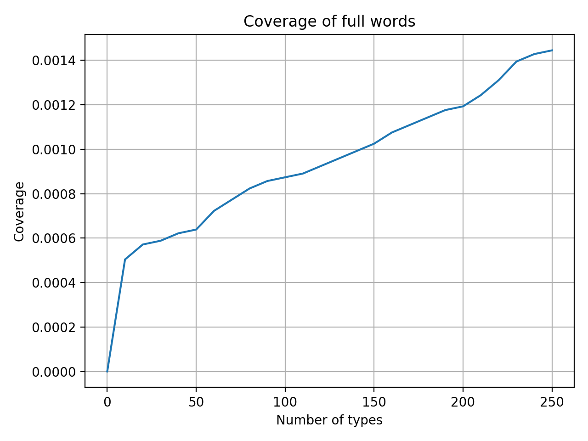
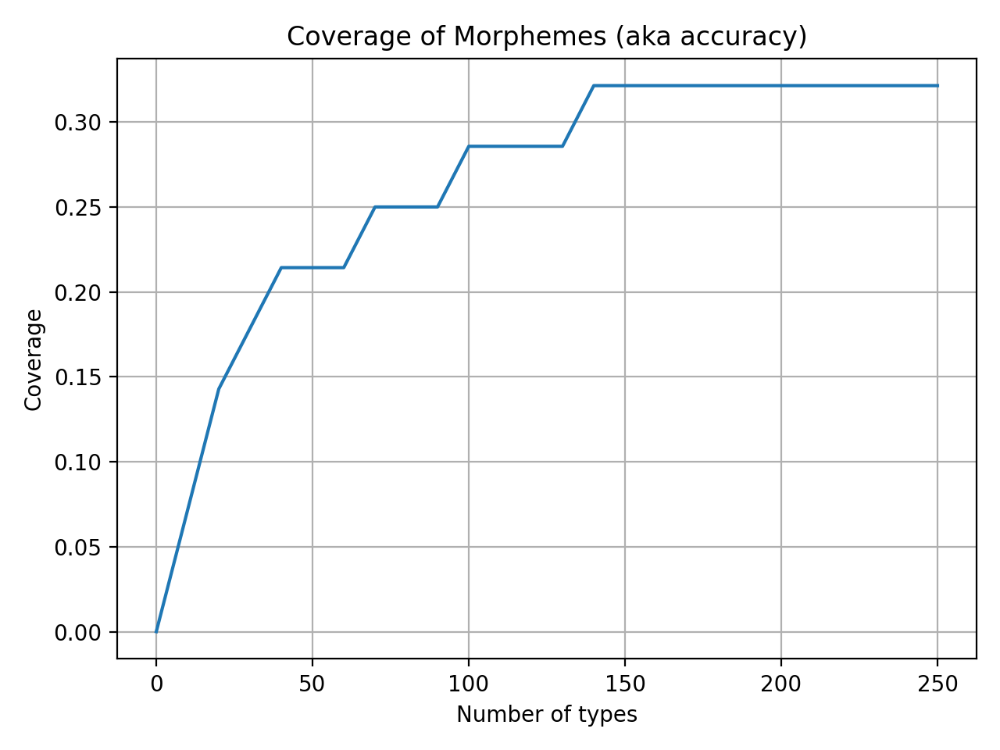

# Milestone 1: Byte Pair Encoding

**Average branch factor of vocabulary:**  
We can see that as we in crease the number of tokens in our token vocabulary(k-value), specifically by merging individual character tokens, to create longer subwords, the Branch factor(number of distinct tokens ever to follow a given token, divided by all tokens) decreases and the longer subwords become more predictive of what comes next.

Notice also the diminishing returns:  
the biggest drop happens in the first few dozen merges; after ~100–150 types the curve starts to flatten out. That suggests that beyond a certain vocab size, each additional merge only marginally improves the “predictability” (in this branching‐factor sense) of our token set.

**Coverage of full words:**  
On the y-axis we see the fraction of all word-tokens in our corpus(test set) that appear in our BPE vocabulary as a single token(i.e. the entire word has been learned).  

At very small vocabs(only characters and a few merges) no whole words are atomic tokens, so coverage is ≈0.

**Coverage of morphemes:**  
Here we measure the fraction of gold-standard morphological segments (prefixes, roots, suffixes, etc.) that exist in our learned vocab as a single token.  

We see this starts climbing quickly (to ~0.25 by ~80 merges) and plateaus around ~0.32 by 140 merges.

BPE picks up common morphemes (e.g. “ing”, “ed”, “pre”, “un”, “tion”, etc.) much sooner than it picks up whole words, and by ~150 merges we’ve captured roughly one‐third of our annotated morphemes.  

**Coverage of stop words:**  
This plots the fraction of all stop‐word tokens (the usual list: “the”, “and”, “to”, “of”, …) that appear in our vocab as single tokens.

Because stop words are extremely frequent, BPE very quickly merges them into one piece. We see coverage already at ~18% with just a few merges, and ramping up to ~78% by ~250 merges.  
In practice this means by a couple hundred merges most common function‐words are represented atomically, which can be a big win for downstream models.  

**Interpretation of plots:**  
These plots help us choose a merge-budget k that balances:  
Getting our frequent function‐words and morphemes atomically represented,
without exploding our vocab size trying to cover rare full words that hardly ever occur.  

---

# Milestone 2: N-Gram

**Bigram Perplexity vs. Add-k Constant**: 
Here we fix $n = 2$ (bigram) and vary the Laplace smoothing constant k on the test set:
At $k=0$ (no extra smoothing), the bigram model achieves its lowest perplexity (~11.1).
As you increase k, it adds add more “virtual” counts to every possible next word, flattening the distribution and steadily raising perplexity up to ~49 at k=245.

**Perplexity vs. n-Gram Order**:  
This plot compares three smoothing/backoff strategies as we increase the model order $n$ from unigram (1) to 6-gram (6):  
Together, these curves trace the progression of our code from basic add-k smoothing (N_Gram_Basic.py), through nterpolation (N_Gram_Advanced.py).  

This chart shows how varying the add-k smoothing constant $𝑘$ in our 6-gram backoff language model affects its test perplexity. At $𝑘=0$, we use pure backoff (no extra smoothing) and achieve the lowest perplexity. As $𝑘$ increases, we add more “virtual” counts to every possible continuation, flattening the conditional distributions and steadily degrading model sharpness, so perplexity climbs almost linearly.  
This sweep underpins the smoothing `get_prob_backoff_logic()` object in 'N_Gram_Advanced.py'. It demonstrates that minimal or zero add-k smoothing is optimal for our dataset, and illustrates why we keep $𝑘$ small when progressing to more advanced interpolation and neural embedding experiments.

## Generated text

%doto: Refer to `milestone_2/generated_texts` 1-6 to see the progression of the n-gram being used alongside the given smoothing strategy.

# Milestone 3: Neural Bigram

## Hardcore

Table of learning rate, k value, and corresponding test perplexity for each test case:

| Test                 | Learning rate | k   | Test perplexity         |
| -------------------- | ------------- | --- | ----------------------- |
| Test                 | 0.0001        | 100 | 51.96405116371911       |
| Test                 | 0.0005        | 100 | 36.184124747417904      |
| Test                 | 0.001         | 100 | 34.02115555646833       |
| Test                 | 0.0001        | 200 | 116.14822555166036      |
| Test                 | 0.0005        | 200 | 60.31262235967866       |
| Test                 | 0.001         | 200 | 52.265199067775704      |
| Test                 | 0.0001        | 300 | 198.03245161646214      |
| Test                 | 0.0005        | 300 | 86.18883114787684       |
| Test                 | 0.001         | 300 | 68.85538667604982       |
| Test                 | 0.0001        | 500 | 409.808096641118        |
| Test                 | 0.0005        | 500 | 164.47371997092182      |
| Test                 | 0.001         | 500 | 117.54506487691079      |
|                      |               |     |                         |
| **Best:**            |               |     |                         |
| Learning rate: 0.001 | k: 100        |     | Test perplexity: 34.021 |

## Soft

Hyperparameter search

Table of learning rate, k value, and corresponding test perplexity for each test case:

| Test                  | Learning rate | k   | Test perplexity         |
| --------------------- | ------------- | --- | ----------------------- |
| Test                  | 0.0001        | 100 | 33.212650299072266      |
| Test                  | 0.0005        | 100 | 32.912742614746094      |
| Test                  | 0.001         | 100 | 33.70339584350586       |
| Test                  | 0.0001        | 200 | 48.84163284301758       |
| Test                  | 0.0005        | 200 | 48.04667663574219       |
| Test                  | 0.001         | 200 | 49.09096145629883       |
| Test                  | 0.0001        | 300 | 59.62310791015625       |
| Test                  | 0.0005        | 300 | 57.317710876464844      |
| Test                  | 0.001         | 300 | 59.76580810546875       |
| Test                  | 0.0001        | 500 | 82.57501220703125       |
| Test                  | 0.0005        | 500 | 76.4788818359375        |
| Test                  | 0.001         | 500 | 79.92401885986328       |
|                       |               |     |                         |
| **Best:**             |               |     |                         |
| Learning rate: 0.0005 | k: 100        |     | Test perplexity: 32.912 |

The comparison between the "Hardcore" and "softer" version of implementing the embeddings shows an aproximate 3.3% increase in perplexity score result (Absolute drop: −1.109 perplexity points).

---

## Extra work: Neural N-Gram
LSTM to incorporate time

Best model: ppl is about 14

# GPT

According to ./milestone_2/plots/PerplexityBigramDifferentK.png, ./milestone_2/plots/Perplexity6_GramDifferentK.png
ppl is increasing with vocab size 
-> artifact of sparsity
-> tryout k values of equal space intervals -> 100, 150, 250 and 2000 (just to see what happens with large k)

Different embedding sizes: 16, 32, 64

wait for the results :)

# Appendix

%doto milestone_2/soft/plots here
%doto milestone_2/hardcore/plots here

